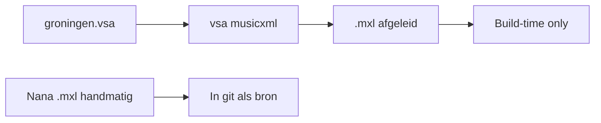

# Verhaal 4 — Rene deelt en gebruikt Nana's MusicXML

*Nana exporteert naast de PDF ook een **MusicXML**-bestand (`.mxl`) van de
Cherubijnenhymne — handig voor koorleden in MuseScore. Rene wil dat bestand
**delen** via de parochie-site en het opnemen in de org-brede **bron**, zonder
het te verwarren met **afgeleide** MXL uit VSA-conversie.*

---

## Situatie

| Bestand              | Herkomst                         | Bron vs afgeleid                                      |
| -------------------- | -------------------------------- | ----------------------------------------------------- |
| `nana-partituur.pdf` | Scan / export van Nana           | **Bron** (parochie-lokaal → bron, verhaal 2–3)        |
| `groningen.vsa`      | Transcriptie (later)             | **Bron**                                              |
| `groningen.mxl`      | Rechtstreeks uit MuseScore (Nana)| **Bron** — niet `vsa musicxml`-output in git          |

Regel: handmatig aangeleverde MusicXML in `sources/musicxml/` is bron; MXL
automatisch gegenereerd uit VSA hoort **niet** in git
([inhoudslevenscyclus §2.2](../../specs/inhoudslevenscyclus.md)).

Export op de site: [exporttype mxl](../../reference/exporttype-mxl.md).

---

## Beoogde interface (GUI)

Rene opent het stuk *cherubijnenhymne / kastorski / groningen* en kiest
**Representatie toevoegen → MusicXML**.

1. **Bestand kiezen:** `.mxl` of `.musicxml` van Nana.
2. **Type:** de tool vraagt “Handmatige bron (MuseScore)” vs “Genereer uit VSA”
   — Rene kiest handmatige bron.
3. **Plaatsing:** voorstel
   - lokaal: `repr/groningen.mxl` in manifest, of
   - bron: `sources/musicxml/groningen.mxl` + entry in yaml.
4. **Samenstelling:** vinkje “Downloadlink op liturgiepagina” → voegt
   `:::include mxl id:cherubijnenhymne/kastorski/groningen:::` toe.
5. **Validatie:** XML well-formed check (toekomst); `catalogus index validate`.

!!! note "GUI + handmatige bron-MXL"
    **`:::include mxl`** vanuit een **VSA-pad** of catalogus-pad is geïmplementeerd.
    Nog **gepland**: GUI voor representatie toevoegen, **handmatige** `.mxl` in
    `sources/musicxml/`, en XML-validatie in CI.

---

## Wat Rene vandaag doet

### 1. Representatie registreren (lokaal)

Rene voegt in `uitvoeringsvorm.yaml` een representatie toe:

```yaml
representaties:
  - representatie-id: scan-nana
    file: repr/nana-partituur.pdf
  - representatie-id: groningen-mxl
    file: repr/groningen.mxl
```

Hij plaatst Nana's `.mxl` in `repr/groningen.mxl`.

### 2. Na promotie naar bron

In `zangstuk.yaml` of genest manifest:

```yaml
sources:
  - id: kastorski-groningen-mxl
    file: sources/musicxml/groningen.mxl
    author: "Nana (parochie Groningen)"
    based_on: kastorski-groningen-scan
    copyright_status: vrij
    note: "Handmatig geëxporteerd MusicXML; geen vsa musicxml-afgeleide"
```

**Niet** committen: MXL gegenereerd met `vsa musicxml` — die hoort bij build-time
([conversie vsa musicxml](../../reference/conversie-vsa-musicxml.md)).

### 3. Catalogus — representatie-id

Als Rene “mxl” of “MusicXML Groningen” als alias wil gebruiken:

```cmd
cd /d C:\Git\orthodox-groningen\bron
python -m catalogus.cli resolve representatie --zangstuk cherubijnenhymne --variant kastorski --uitvoeringsvorm groningen groningen-mxl --content-root C:\Git\orthodox-groningen\VSA-demo\content-source
```

(Canoniek id-passthrough als alias nog niet geregistreerd.)

### 4. Opnemen in sjabloon / samenstelling

In het sjabloon (verhaal 1) blijven de includes met **`zoek=`**:

```markdown
:::include svg zoek="Cherubijnenhymne (Kastorski)" alt="Cherubijnenhymne":::
:::include mxl zoek="Cherubijnenhymne (Kastorski)" label="Download partituur (MusicXML)":::
```

**Na **`vsa resolve-catalogus`** (parochie-lokaal, MXL als sibling van `.vsa`):

```markdown
## Cherubijnenhymne

:::include svg lokaal:cherubijnenhymne/kastorski/groningen alt="Cherubijnenhymne":::
:::include mxl lokaal:cherubijnenhymne/kastorski/groningen label="Download partituur (MusicXML)":::
```

**Beperking:** `mxl` / `coria` op **`bron:`** catalogus-pad — `.vsa` buiten content-root.
Handmatig MXL in repo blijft geldig; build levert download-URL naar static.

Build-time generatie blijft gescheiden: de site levert een **download-URL** naar
het **bron**-bestand; `vsa musicxml` draait niet in de Hugo-build voor dit
handmatige MXL.

### 5. Delen met koorleden

| Kanaal              | Wat Rene doet                                                |
| ------------------- | ------------------------------------------------------------ |
| Parochie-site       | Samenstelling met svg + (later) mxl-download                 |
| E-mail / chat       | Link naar pagina, niet los MXL in mail (één canonical bron) |
| Andere parochies    | Na merge bron: zij sync'en `zangstukken/cherubijnenhymne/`   |

### 6. Validatie

```cmd
python -m catalogus.cli index validate --bron-root C:\Git\orthodox-groningen\bron --content-root C:\Git\orthodox-groningen\VSA-demo\content-source
```

---

## Verschil met VSA-afgeleide MXL



Rene legt Nana uit: zodra er een goede VSA-transcriptie is, kan de site **ook**
automatische MXL uit VSA aanbieden naast Nana's originele export — twee
representaties, één uitvoeringsvorm.

---

## Wat Rene bereikt

- Koorleden downloaden MusicXML vanaf dezelfde pagina als de liturgienotatie.
- Bron vs afgeleid blijft helder voor CI en toekomstige sync.
- Canonieke ids blijven gelijk over PDF, VSA en MXL heen.

## Terug naar overzicht

- [Catalogus — gebruikersverhalen](index.md)
- [Catalogus CLI](../../reference/catalogus-cli.md)
