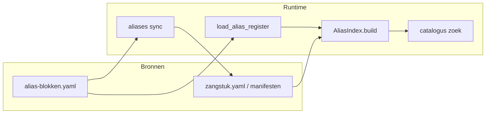

# Alias-blokken — ontwerp

Status: **ontwerp + basis-implementatie** (juli 2026).

Gerelateerd idee: [alias-blokken (idee)](ideeen/alias-blokken.md).

---

## Doel

Org-brede **synoniemsets** voor liturgische rollen, gelegenheden en liturgische
onderdelen. Eén term uit een set volstaat als annotatie; het register breidt uit naar
alle leden. Profiteert o.a. [catalogus zoek](../specs/catalogus-zoek-api.md) (`zoek="Kondak"`
vindt yaml met alleen `Kondakion`).

**Niet hetzelfde als** entiteitsspecifieke aliassen (terminologie §2.5: `Groningen`,
`Kastorski`). Die blijven per zangstuk, variant of uitvoeringsvorm.

---

## Register

| Eigenschap     | Waarde |
| -------------- | ------ |
| **Pad**        | `catalogus/data/alias-blokken.yaml` (repo-root) |
| **Scope**      | Org-breed; zelfde bestand voor bron en parochie-lokaal |
| **Uitbreiden** | Nieuwe blokken of aliassen toevoegen; elk alias op **eigen regel** |
| **Validatie**  | `python -m catalogus.cli aliases validate --bron-root .` |

### Schema

```yaml
blokken:
  <blok-id>:
    aliassen:
      - <term>
      - <term>
```

**Blok-id:** vrije string (canoniek slug `kondak` of liturgische naam
`Geboorte van Christus`). Geen hardcoded set in code — loader leest alles uit yaml.

**Validatieregels:**

- Elke alias uniek over **alle** blokken na `normalize_for_match()` (casefold)
- Geen lege blok-id of lege alias-lijst
- Dubbele yaml-sleutel (zelfde blok-id tweemaal) → laatste wint; **vermijden** (verlies data)

---

## Ontwerpkeuzes

| Onderwerp | Besluit |
| --------- | ------- |
| **Trigger (yaml-sync)** | Later: `liturgische_rol:` / `alias_blok:` in yaml; fallback id-prefix |
| **Runtime** | `AliasIndex.build()` laadt register; zoektermen worden uitgebreid via blokken |
| **Sync naar yaml** | `catalogus aliases sync` + `--check` in CI |
| **Conflicten index** | Bestaande scope-regels (terminologie §2.6); ongewijzigd |
| **Gegenereerde aliassen** | Alleen zoekindex; **niet** resolver-scope (meerdere kondak-stukken delen dezelfde rol-termen) |
| **Architectuur** | Register = bron; afgeleide yaml-aliassen = sync (update [catalogus-architectuur](../specs/catalogus-architectuur.md) bij sync-PR) |
| **Terminologie** | Glossary-term `alias-blok` volgt in aparte PR (R3) |

---

## Dataflow



---

## Implementatiestatus

| Onderdeel | Status |
| --------- | ------ |
| Register + review | `catalogus/data/alias-blokken.yaml` |
| Loader | `src/catalogus/alias_blokken.py` |
| CLI validate | `catalogus aliases validate` |
| Zoek-expansie | `src/catalogus/alias_index.py` (`_build_search_terms`) |
| Sync yaml | `catalogus aliases sync` — geïmplementeerd |
| Glossary `alias-blok` | Open |
| CI | `.github/workflows/validate-catalogus.yml` |

---

## Register uitbreiden

1. Voeg blok of alias toe in `catalogus/data/alias-blokken.yaml`
2. Draai `python -m catalogus.cli aliases validate --bron-root .`
3. Geen code-wijziging nodig — loader is data-driven
4. Bij overlap tussen blokken: validatie faalt; herstructureer of verwijder dubbele term

**Let op:** termen die in meerdere blokken voorkomen (bijv. korte feestnamen) veroorzaken
bewust een fout — kies unieke aliassen of één blok per term.

---

## Open vervolg

- Glossary-PR terminologie § alias-blok
- Veld `liturgische_rol:` in [zangstuk-formaat](../specs/zangstuk-formaat.md)
- Apart blok `troparion-melodie` (niet mengen met `tropaar`)
- Update [catalogus-architectuur](../specs/catalogus-architectuur.md) (register + afgeleide yaml)
