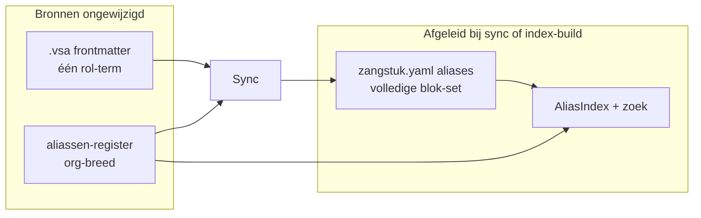

# Idee: alias-blokken liturgische rollen

| Veld             | Waarde     |
| ---------------- | ---------- |
| **Id**           | `alias-blokken` |
| **Status**       | `voorbereid` |
| **Repo**         | bron       |
| **Laatst bekeken** | 2026-07-04 |
| **Ontwerp**      | [alias-blokken-ontwerp.md](../alias-blokken-ontwerp.md) |

## Samenvatting

Voor liturgische rollen als **kondak** en **troparion** bestaan gangbare synoniemen
(`kondak` / `kondaak` / `kondakion` / `kontakion`; `troparion` / `tropaar`). Bij
annotatie van een brondocument (bijv. VSA-frontmatter) volstaat **één** term uit zo'n
set. Een centraal **aliassen-register** breidt die ene term uit naar alle varianten in
de bijbehorende **yaml-registratie(s)** (`zangstuk.yaml`, eventueel `variant.yaml` /
`uitvoeringsvorm.yaml`). Het brondocument zelf wordt **niet** automatisch gewijzigd.
Bij wijziging van brondocument of register worden aliassen opnieuw uitgerekend. Hetzelfde
register geldt voor **bron** en **lokaal**.

## Beoordeling

**Zinvol — ja.**

- Liturgische rol-synoniemen zijn nu impliciet en inconsistent: titels gebruiken `Tropaar`
  en `Kondak`, sjablonen zoeken met `Troparion` en `Kondakion`, en handmatige `aliases:`
  in yaml zijn gedeeltelijk (bijv. alleen `Troparion` of `Kondakion` + `Kondak`).
- [catalogus.zoek](../../specs/catalogus-zoek-api.md) matcht op geïndexeerde teksten;
  zonder systematische uitbreiding kan `zoek="Kondak"` een stuk missen dat alleen
  `Kondakion` in yaml heeft (en omgekeerd).
- Eén annotatie plus register voorkomt copy-paste en drift tussen bron, lokaal en zoek.

**Afgebakend:** alias-blokken zijn **niet** hetzelfde als entiteitsspecifieke aliassen
(terminologie §2.5: `Groningen`, `Kastorski`). Blokken zijn org-brede synoniemsets voor
**liturgische rollen**; entiteitsaliassen blijven per zangstuk, variant of uitvoeringsvorm.

## Nu al organiseren

1. **Geen nieuwe handmatige alias-lijsten uitbreiden** in `zangstuk.yaml` — houd
   bestaande minimale entries tot het sync-mechanisme bestaat; anders dubbel werk.
2. **Registerlocatie reserveren:** voorstel `catalogus/data/alias-blokken.yaml` in de
   bron-root — versioneerbaar, leesbaar door `AliasIndex` en een toekomstige sync-CLI;
   parochie-builds via `--bron-root`.
3. **Architectuur-spanning expliciet houden:** [catalogus-architectuur § Index vs opslag](../../specs/catalogus-architectuur.md)
   zegt “geen gegenereerd alias-bestand in git”. Oplossing bij implementatie: het
   **register** is bron; **uitgebreide `aliases:` in yaml** zijn afgeleid (vergelijkbaar
   met [`scripts/sync_zangstuk_yaml_from_vsa.py`](https://github.com/orthodox-groningen/bron/blob/main/scripts/sync_zangstuk_yaml_from_vsa.py)).
4. **Terminologie:** `alias-blok` is een nieuwe term — pas bij implementatie via
   glossary-PR op [terminologie.md](../../specs/terminologie.md) (R3); tot die tijd
   alleen in dit idee-document.
5. **Annotatieveld nog niet standaardiseren** in [zangstuk-formaat.md](../../specs/zangstuk-formaat.md)
   — open keuze: `liturgische_rol:` in VSA-frontmatter vs yaml-trigger vs titel-parsing.

## Initiële blokken (implementatiefase)

| Blok-id     | Aliassen (startset)                                      |
| ----------- | -------------------------------------------------------- |
| `kondak`    | `kondak`, `kondaak`, `kondakion`, `kontakion`            |
| `troparion` | `troparion`, `tropaar`                                   |

Eventueel later een apart blok voor `troparion-melodie` / `tropaarmelodie` — niet mengen
met het tropaar/troparion-blok.

## Open ontwerpvragen

Opgelost in [alias-blokken-ontwerp.md](../alias-blokken-ontwerp.md). Runtime-expansie en
register-validatie zijn geïmplementeerd; yaml-sync en glossary volgen.

## Relatie bestaande code

| Onderdeel                                                                                    | Rol                                                                 |
| -------------------------------------------------------------------------------------------- | ------------------------------------------------------------------- |
| [`src/catalogus/alias_index.py`](https://github.com/orthodox-groningen/bron/blob/main/src/catalogus/alias_index.py) | Aliassen per entiteit uit yaml en manifesten; runtime `AliasIndex`  |
| [catalogus-architectuur](../../specs/catalogus-architectuur.md)                              | Resolver en index-build; spannt met afgeleide yaml-aliassen         |
| [catalogus-zoek-api](../../specs/catalogus-zoek-api.md)                                        | Zoek op geïndexeerde teksten; profiteert van volledige blok-sets    |
| [`scripts/sync_zangstuk_yaml_from_vsa.py`](https://github.com/orthodox-groningen/bron/blob/main/scripts/sync_zangstuk_yaml_from_vsa.py) | Precedent: yaml afgeleid uit VSA-frontmatter, brondocument ongewijzigd |

## Implementatieschets (later)

1. Registerbestand plus loader in `catalogus`
2. `expand_alias_blok(term) → frozenset[str]`
3. Sync: scan bron en lokaal manifesten/frontmatter → herbereken `aliases:` op
   zangstuk- of source-niveau
4. `AliasIndex.build()` laadt register en yaml (eventueel dubbele expansie als
   veiligheidsnet)
5. Tests in `tests/fixtures/alias-index/`; CI: `catalogus index validate` plus
   sync drift-check
6. Docs: update catalogus-architectuur plus handleiding “zangstuk annoteren”
