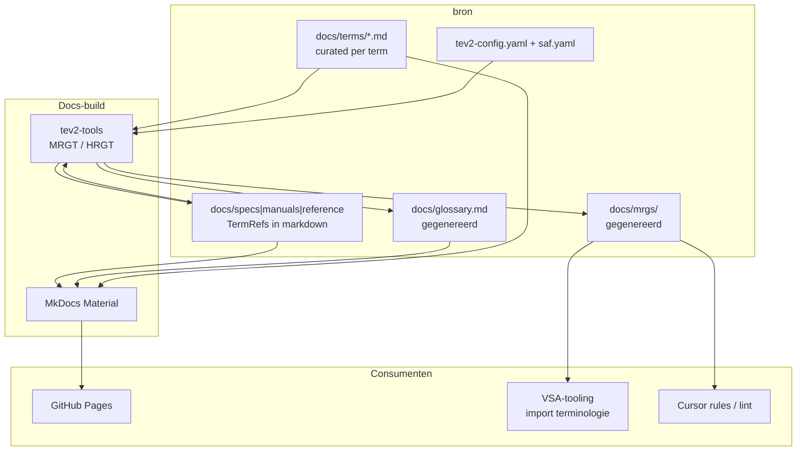

# Idee: TEv2-terminologie in bron-documentatie

| Veld               | Waarde           |
| ------------------ | ---------------- |
| **Id**             | `tev2-terminologie` |
| **Status**         | `idee`           |
| **Repo**           | bron (primair); VSA-tooling (consument) |
| **Laatst bekeken** | 2026-07-04       |

## Samenvatting

[TEv2](https://tno-terminology-design.github.io/tev2-specifications/docs/category/introduction-overview)
(Terminology Engine v2) is een specificatie- en toolset voor het **cureren** van terminologie
en het **gebruik** ervan in publicaties. De bedoeling is in **`bron`** een terminologie-directory
te introduceren waarin **elke term een eigen pagina** krijgt — met definitie, voorbeelden van
wat het wel en niet is, en uitleg over aanmaken, wijzigen en verwijderen. Terminologie wordt
een **integraal onderdeel** van de MkDocs-site; uit de curated terms kan een **glossary-pagina**
worden gegenereerd. **VSA-tooling** importeert de terminologie uit `bron` (geen volledige kopie).
Op alle documentatie-, handleiding- en uitlegpagina's worden gedefinieerde woorden omgezet naar
TEv2-**TermRefs** — machine-leesbare verwijzingen naar de canonieke termdefinitie.

## Externe referenties (TEv2)

| Repo | Rol |
| ---- | --- |
| [tev2-specifications](https://github.com/tno-terminology-design/tev2-specifications) | Normatieve TEv2-specificaties (o.a. TermRef, MRG, curated texts) |
| [tev2-tools](https://github.com/tno-terminology-design/tev2-tools) | CLI-tools (MRGT, HRGT, …) voor generatie en conversie |
| [tev2-mve](https://github.com/tno-terminology-design/tev2-mve) | Minimal viable example met GitHub Pages — structuur en workflow |

Typische TEv2-bestanden (zie [tev2-mve README](https://github.com/tno-terminology-design/tev2-mve)):

| Bestand / map | Functie |
| ------------- | ------- |
| `docs/terms/` | Curated texts — één bestand per term |
| `docs/tev2-config.yaml` | Toolconfiguratie |
| `docs/saf.yaml` | Scope Administration File |
| `docs/mrgs/` | Machine-readable glossaries (gegenereerd) |
| `docs/glossary.md` | Mensleesbare glossary (gegenereerd) |
| TermRefs in bronmarkdown | Gedefinieerde woorden linken naar term-pagina's |

## Beoordeling

**Zinvol — ja.**

- [terminologie.md](../../specs/terminologie.md) is nu één groot normatief document (~465 regels);
  per-term pagina's maken definities, tegenexamples en lifecycle-uitleg beter onderhoudbaar.
- §0 vermeldt al: *“Implementatie van automatische terminologie-lint: open (fase 2)”* — TEv2
  TermRefs en MRG zijn een concreet pad daarnaartoe.
- [documentatie-eigendom.md](../../specs/documentatie-eigendom.md) D1/D4: org-brede terminologie
  hoort in **`bron`**; andere repo's linken of **importeren** — past bij TEv2-scope + VSA-import.
- TermRefs in handleidingen en specs vermindert R1/R2-schendingen (verkeerd synoniem, verwarrend
  gangbaar woord) doordat lezers direct naar de canonieke definitie gaan.

**Afgebakend:** TEv2 regelt **terminologie-curatie en -publicatie**; het vervangt geen
zangstuk-metadata, catalogus-resolver of VSA-syntax. Tool-specifieke termen blijven in
VSA-tooling; org-termen blijven canoniek in `bron`.

**Risico's:**

- Migratie van monolithische `terminologie.md` → curated terms is arbeidsintensief; incrementele
  overgang nodig.
- MkDocs Material ≠ Docusaurus (tev2-mve); integratie (CI-stap, plugin, preprocess) moet worden
  uitgezocht.
- Cursor-regel [`.cursor/rules/orthodox-groningen-terminologie.mdc`](https://github.com/orthodox-groningen/bron/blob/main/.cursor/rules/orthodox-groningen-terminologie.mdc)
  en stubs in andere repo's moeten synchroon blijven met de TEv2-bron.

## Nu al organiseren

1. **Geen ad-hoc nieuwe precieze termen** buiten [terminologie.md](../../specs/terminologie.md)
   — R3 blijft gelden tot migratie; wel dit idee als geplande richting gebruiken bij
   terminologiediscussies.
2. **Directory reserveren** (voorstel): `docs/terms/` voor curated texts; gegenereerd:
   `docs/glossary.md`, `docs/mrgs/` — parallel aan tev2-mve, afgestemd op MkDocs.
3. **Niet dupliceren in VSA-tooling** — alleen stub plus import/build-time fetch van `bron`
   (documentatie-eigendom D1/D2).
4. **TermRef-conventie nog niet in bestaande pagina's massaal toepassen** tot toolchain staat;
   anders half geconverteerde docs.
5. **TEv2-tools evalueren** lokaal tegen een kopie van `docs/` (MRGT/HRGT in CI of
   `scripts/docs-build.cmd`) vóór commit aan MkDocs-pipeline.

## Doelbeeld (bron)

## Relatie huidige situatie

| Onderdeel | Huidige situatie | Na implementatie (doel) |
| --------- | ---------------- | ----------------------- |
| [terminologie.md](../../specs/terminologie.md) | Monolithisch normatief | Stub/index of gefaseerd afgebouwd; termen in `docs/terms/` |
| MkDocs nav | `specs/terminologie.md` | + `glossary.md`; term-pagina's onder Terminologie |
| VSA-tooling | Link-stub naar bron | Import MRG/curated terms voor eigen docs |
| §0 R1–R5 | Handmatige review | TermRefs + optionele lint (fase 2) |

## Open ontwerpvragen

- **Migratiestrategie:** big-bang of term-voor-term (beginnen met vier-niveau-model)?
- **Normativiteit:** blijft één MRG/`saf.yaml` leidend, of per term-pagina frontmatter?
- **TermRef-syntax** in Nederlands markdown — TEv2-default of project-specifieke profile?
- **MkDocs-integratie:** preprocess vóór `mkdocs build`, Material-plugin, of aparte GH Actions-stap
  (patroon [tev2-mve deploy-docs.yml](https://github.com/tno-terminology-design/tev2-mve))?
- **Glossary-plaatsing:** vervangt `specs/terminologie.md` in nav, of naast elkaar tijdens overgang?
- **Cursor/AGENTS:** MRG-export naar `.mdc` of handmatige samenvatting houden?

## Implementatieschets (later)

1. TEv2-basis in `docs/`: `tev2-config.yaml`, `saf.yaml`, eerste curated terms (pilot: `zangstuk`,
   `variant`, `uitvoeringsvorm`, `representatie`)
2. CI: `tev2-tools` draaien → `mrgs/`, `glossary.md`, TermRef-conversie op `docs/`
3. MkDocs nav: Terminologie-sectie met glossary + term-index
4. Migratieplan `terminologie.md` → curated terms (behoud §0 gebruiksregels centraal)
5. VSA-tooling: build-time import MRG uit `bron` (tag/ref), TermRefs in tool-docs
6. Optioneel: lint/PR-check op onbekende TermRefs of R1-schendingen
