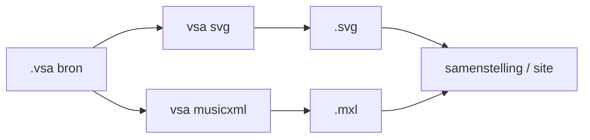

# Conversiemechanismen

Referentie voor **[conversiemechanismen](@)** (bijv. `.vsa` → `.svg` / `.mxl`).

Conversie is **geen** export: conversie verandert het formaat; export bepaalt hoe
[afgeleiden](@) in een [samenstelling](@) verschijnen
([Exportcontracten](exportcontracten.md) — [exportmechanismen](@)).

Uitvoering gebeurt met [VSA-tooling](@)
([CLI-overzicht](https://orthodox-groningen.github.io/VSA-tooling/reference/cli/)).
[Afgeleide](@) output hoort **niet** in de [bron-repository](@).

---

## Conversie vs. export

| Laag                         | Vraag                                          | Voorbeeld                         |
| ---------------------------- | ---------------------------------------------- | --------------------------------- |
| [Conversiemechanisme](@)     | Wat is de [afgeleide](@) en hoe maak ik die?   | `.vsa` → `.svg` of `.mxl`         |
| [Exportmechanisme](@)        | Hoe toon ik die in een [samenstelling](@)?     | `:::include svg "lied.vsa"`       |

---

## Geregistreerde mechanismen

| Mechanisme                                                                                 | Contract                                            | Output               | CLI                                                                                  |
| ------------------------------------------------------------------------------------------ | --------------------------------------------------- | -------------------- | ------------------------------------------------------------------------------------ |
| [`vsa svg`](https://orthodox-groningen.github.io/VSA-tooling/reference/cli/svg/)           | [conversie-vsa-svg](conversie-vsa-svg.md)           | `.svg`               | [man-page](https://orthodox-groningen.github.io/VSA-tooling/reference/cli/svg/)      |
| [`vsa musicxml`](https://orthodox-groningen.github.io/VSA-tooling/reference/cli/musicxml/) | [conversie-vsa-musicxml](conversie-vsa-musicxml.md) | `.mxl` / `.musicxml` | [man-page](https://orthodox-groningen.github.io/VSA-tooling/reference/cli/musicxml/) |

---

## Pipeline-volgorde (doel)

**Huidige stand:** SVG-conversie draait deels inline tijdens document-build;
MXL wordt handmatig of in de site-build gegenereerd. Een expliciete conversiestap
vóór export is gepland — zie [CI-architectuur](../plans/ci-architectuur.md).

---

## Toekomstige conversies

| Mechanisme | Input   | Output | Status                                        |
| ---------- | ------- | ------ | --------------------------------------------- |
| Scan → VSA | PDF/png | `.vsa` | Niet geautomatiseerd; handmatige transcriptie |
| Audio      | —       | —      | Nog niet gedefinieerd                         |

Nieuwe [conversiemechanismen](@) krijgen een volledig org-contract **vóór** opname in CI.

---

## Gerelateerd

- [Exportcontracten](exportcontracten.md)
- [Inhoudslevenscyclus](../specs/inhoudslevenscyclus.md) Deel 2
- [Schrijfconventies](../specs/schrijfconventies.md)
- [VSA CLI-overzicht](https://orthodox-groningen.github.io/VSA-tooling/reference/cli/)
