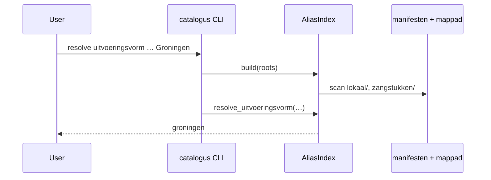
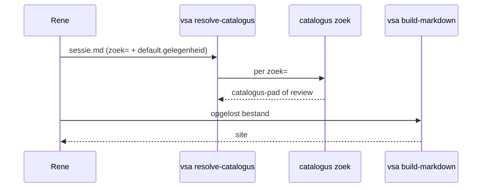

# Catalogus — architectuur (fase 2)

Status: geïmplementeerd (basis).

Normatief resolver-contract: [terminologie §2.8](../specs/terminologie.md).

## Doel

De **catalogus**-tool beantwoordt: *welk [zangstuk](@) ([variant](@), [uitvoeringsvorm](@),
[representatie](@)) bedoel je?* Invoer mag gangbare namen (`Groningen`, `Касторский`);
opslag blijft [canoniek id](@) (`groningen`, `kastorski`).

## Plaatsing

| Onderdeel        | Locatie                                                                                                                                                                                                              |
| ---------------- | -------------------------------------------------------------------------------------------------------------------------------------------------------------------------------------------------------------------- |
| Python-pakket    | `src/catalogus/` in **bron**                                                                                                                                                                                         |
| CLI              | `catalogus` (entry point)                                                                                                                                                                                            |
| Documentatie     | [catalogus-cli.md](../reference/catalogus-cli.md), [catalogus-zoek-api.md](catalogus-zoek-api.md), [gebruikersverhalen](../manuals/catalogus/index.md), [zangstuk in sjablonen](catalogus-samenstelling-zangstuk.md) |
| Test-fixtures    | `tests/fixtures/alias-index/`                                                                                                                                                                                        |

[Bron-repository](@)-workflows kunnen `catalogus` draaien **zonder** [VSA-tooling](@).
[VSA-tooling](@) wordt in fase 3 **consument** van de library (id-gebaseerde includes).

## Datastroom



## Index vs opslag

| Laag    | Wat                                                                |
| ------- | ------------------------------------------------------------------ |
| Opslag  | [Aliassen](@) verspreid in git ([manifesten](@), mapnamen, titels) |
| Runtime | `AliasIndex` in RAM — lookup per scope, conflict-detectie          |

Geen gegenereerd alias-bestand in git.

## Scope en uniciteit

Zie terminologie §2.6. Conflicten (zelfde [alias](@) → verschillende ids binnen scope)
worden bij index-build gerapporteerd via [`catalogus index validate`](../reference/catalogus-cli.md#catalogus-index-validate).

## Bekende randgevallen

1. **Plat bron-model** — `zangstuk.yaml` `sources[].id` wordt geregistreerd onder
   scope `(zangstuk-id, zangstuk-id)` tot geneste [manifesten](@) in bron (§22) bestaan.
2. **[Alias](@) van [variant](@) ook als zangstuk-alias** — [aliassen](@) in `variant.yaml` worden
   pragmatisch ook op zangstuk-niveau geïndexeerd (demo: `1e antifoon weekdagen`).
3. **[Aliassen](@) op [representatie](@)** — minimaal; [canoniek id](@)-passthrough.

## Fase 3 — id-gebaseerde includes ([VSA-tooling](@))

Status: **geïmplementeerd (basis)**.

```markdown
:::include svg id:antifoon-1-weekdagen/liturgikon-weekdagen/Hemelum:::
:::include svg lokaal:…:::
:::include svg bron:troparion-zondag-toon-1/groningen:::
```

[VSA-tooling](@) importeert `catalogus` en lost catalogus-paden op tijdens de
markdown-include-stap. Relatieve pad-includes blijven werken. Zie
[directives](https://github.com/orthodox-groningen/VSA-tooling/blob/main/docs/specification/directives.md).

## Fase 4 — sjablonen, sessies, resolve

Status: **geïmplementeerd** (basis).

Normatief zoek-API: [catalogus-zoek-api.md](catalogus-zoek-api.md).

Parochie-**sjablonen** zijn markdown met:

- **`default.gelegenheidstype`** (geen individuele feesten in het sjabloon);
- **`:::include`** met een [exporttype](@) en `zoek="…"` — liturgische rol;
- **sessie**: Rene voegt **`default.gelegenheid`** toe;
- uitkomst na **`vsa resolve-catalogus`**: catalogus-pad in dezelfde includes.



Geïmplementeerd: [`catalogus zoek`](../reference/catalogus-cli.md#catalogus-zoek),
[`vsa resolve-catalogus`](https://orthodox-groningen.github.io/VSA-tooling/reference/cli/resolve-catalogus/),
**`@include-vsa zoek=`**
(zie [catalogus-zoek-api.md](catalogus-zoek-api.md)).

**Demo-end-to-end:** sjabloon
`sjablonen/goddelijke-liturgie-groningen.md`, sessie
`samenstellingen/geboorte-moeder-gods-2026.md` (mixed session: bron `liturgikon` +
lokaal `groningen`).

**Beperking:** [exporttypen](@) `coria` / `mxl` op `bron:` catalogus-pad — `.vsa` buiten content-root.

Consument **`@include-vsa zoek=`** in `.vsa`-brontekst gebruikt dezelfde `catalogus.zoek`-API
(in-memory expand; zie [catalogus-zoek-api.md](catalogus-zoek-api.md)).

## Later (fase 5+)

- Zoek-UI / fuzzy match bovenop **`catalogus.zoek_kandidaten`**
