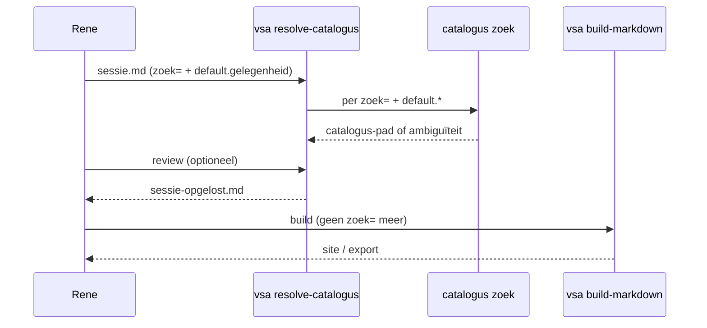

# Catalogus — zangstuk-opzoeken in sjablonen en samenstellingen

Status: **normatief** (geïmplementeerd, basis).

Gerelateerd: [terminologie §2.8](terminologie.md), [catalogus-architectuur](catalogus-architectuur.md),
[samenstelling §18](terminologie.md#18-samenstelling), [exportcontracten](../reference/exportcontracten.md).

---

## Doel

Rene werkt in **markdown-sjablonen** (geen uitgebreide yaml-bomen). Op vaste plekken
staat **`:::include`** met exporttype (`svg`, `coria`, `mxl`, …) en parameter
**`zoek="…"`** — nog geen catalogus-pad. Tussen de includes: gewone markdown
(kopjes, liturgische aanwijzingen).

De **catalogus** zoekt het stuk op (met **`default.*`** uit de sessie) en levert een
**catalogus-pad**. [`vsa resolve-catalogus`](https://orthodox-groningen.github.io/VSA-tooling/reference/cli/resolve-catalogus/) schrijft dat pad in het markdown-bestand;
pas daarna mag [`vsa build-markdown`](https://orthodox-groningen.github.io/VSA-tooling/reference/cli/build-markdown/) / export draaien.

VSA-build (`:::include` zonder `zoek=`) en **`@include-vsa`** in `.vsa`-brontekst vallen buiten dit
document qua syntax; beide **`zoek=`**-varianten gebruiken dezelfde resolver — zie
[catalogus-zoek-api.md](catalogus-zoek-api.md).

---

## Woorden: niet door elkaar halen

| Term                       | Betekenis                                                     | Voorbeeld                                   |
| -------------------------- | ------------------------------------------------------------- | ------------------------------------------- |
| **referentie**             | **Herkomst**-metadata ([§9](terminologie.md))                 | `referentie: VOK` — filter, geen pad        |
| **catalogus-pad**          | Opgelost doel in de catalogus                                 | `bron:cherubijnenhymne/kastorski/groningen` |
| **`zoek=`**                | Parameter op `:::include` — liturgische rol, nog op te zoeken | `zoek="Kondakion"`                          |
| **zangstuk** (glossary §5) | Entiteit met `zangstuk-id`                                    | In opslag; Rene typt geen id                |

**Niet synoniem:** **`referentie`** ≠ **catalogus-pad**.

---

## Sjabloon vs sessie

|                                | **Sjabloon** (herbruikbaar)               | **Sessie** (concrete liturgiemap)                 |
| ------------------------------ | ----------------------------------------- | ------------------------------------------------- |
| **Wie**                        | Eén keer ontwerpen                        | Rene per feest / dienst                           |
| **`default.gelegenheid`**      | **Niet** — geen individuele feesten       | **Wel** — Rene vult in                            |
| **`default.gelegenheidstype`** | **Wel** — `vast-feest` \| `zondag-cyclus` | Overnemen of bevestigen                           |
| **`default.toon`**             | Alleen in koormap-sjablonen (placeholder) | Bij zondag-cyclus invullen                        |
| **`default.uitvoeringsvorm`**  | Parochie-default (bijv. `Groningen`)      | Alleen bij **homogene** sessie; zie mixed session |
| **Includes**                   | `:::include svg zoek="Troparion" …`       | Zelfde regels; na resolve: `bron:…` / `lokaal:…`  |

<a id="mixed-session"></a>

### Mixed session (bron + parochie-lokaal)

Eén dienst kan **verschillende uitvoeringsvormen** nodig hebben — bijv. feest-troparion uit
**bron** (`uitvoeringsvorm-id: liturgikon`) naast Cherubijnenhymne **lokaal**
(`uitvoeringsvorm-id: groningen`).

| Aanpak                                                  | Wanneer                                                  |
| ------------------------------------------------------- | -------------------------------------------------------- |
| **`default.uitvoeringsvorm` weglaten** in de **sessie** | Bron- en lokaal-stukken in één liturgiemap               |
| Disambiguation in `zoek=`                               | Bijv. `Cherubijnenhymne (Kastorski)`                     |
| **`default.uitvoeringsvorm: Groningen`** in sessie      | Alleen als **alle** includes die parochie-praktijk delen |

Demo: `geboorte-moeder-gods-2026.md` — geen `uitvoeringsvorm` in sessie-frontmatter;
resolve levert `bron:…/liturgikon` voor Troparion/Kondakion en
`lokaal:cherubijnenhymne/kastorski/groningen` voor de Cherubijnenhymne.

Het sjabloon beschrijft **structuur** en **liturgische rol** (`Troparion`, `Kondakion`,
`Cherubijnenhymne`). De **gelegenheid** (`geboorte-moeder-gods`, …) hoort in de
**sessie-frontmatter**, niet in elke `zoek=`-tekst.

---

## Drie lagen in het markdown-bestand

| Laag                     | Wie                                                                                                                      | Inhoud                                         |
| ------------------------ | ------------------------------------------------------------------------------------------------------------------------ | ---------------------------------------------- |
| **Sessie**               | Rene                                                                                                                     | Frontmatter: `sjabloon`, `titel`, `default`, … |
| **Includes met `zoek=`** | Catalogus + [`vsa resolve-catalogus`](https://orthodox-groningen.github.io/VSA-tooling/reference/cli/resolve-catalogus/) | `:::include <exporttype> zoek="…" …`           |
| **Vrije frontmatter**    | Rene                                                                                                                     | Eigen sleutels; catalogus **negeert**          |

Tussen includes: gewone markdown.

---

## Sessie (frontmatter)

| Sleutel    | Verplicht  | Betekenis                          |
| ---------- | ---------- | ---------------------------------- |
| `sjabloon` | nee        | Id of pad van het sjabloon-bestand |
| `titel`    | nee        | Weergavetitel (concrete dienst)    |
| `default`  | aanbevolen | Context voor catalogus-zoekactie   |
| `bronnen`  | nee        | `bron`, `lokaal`, of beide         |

### `default` (enkelvoud)

| Sleutel onder `default` | In sjabloon          | In sessie      | Betekenis                       |
| ----------------------- | -------------------- | -------------- | ------------------------------- |
| `gelegenheidstype`      | **ja**               | ja             | `vast-feest` \| `zondag-cyclus` |
| `gelegenheid`           | **nee**              | **ja** (feest) | Canoniek gelegenheid-id         |
| `toon`                  | koormap: placeholder | ja (zondag)    | Zondagstoonsysteem              |
| `uitvoeringsvorm`       | ja                   | ja             | Parochie-default                |
| `gelegenheidsdatum`     | nee                  | optioneel      | `"MM-DD"`                       |

**Sjabloon** (dienst — geen individueel feest):

```yaml
---
sjabloon: goddelijke-liturgie-groningen
default:
  gelegenheidstype: vast-feest
  uitvoeringsvorm: Groningen
---
```

**Sessie** (Rene voor 8 september — mixed session, geen `uitvoeringsvorm`):

```yaml
---
sjabloon: goddelijke-liturgie-groningen
titel: "Goddelijke liturgie — Geboorte Moeder Gods (8 september)"
default:
  gelegenheid: geboorte-moeder-gods
  gelegenheidstype: vast-feest
  toon: 4
---
```

---

## `:::include` met `zoek=` (hoofdingang)

Rene specificeert per plek **welk exporttype** op de site komt — meerdere regels met
**dezelfde** `zoek=` zijn toegestaan (svg + coria + toekomstig mp3-player).

```markdown
### Troparion

:::include svg zoek="Troparion" alt="Troparion" scale="85%":::
:::include coria zoek="Troparion" label="Oefenen Troparion" mode="auto":::

Tekst of aanwijzing voor het koor (vrij).

### Kondakion

:::include svg zoek="Kondakion" alt="Kondakion":::
```

**Regels voor `zoek=`**

- Liturgische **rol** — geen feestnaam als `default.gelegenheid` al gezet is.
- Uitzondering: disambiguation in de zoektekst, bijv.
  `zoek="Cherubijnenhymne (Kastorski)"`.
- Geen `variant-id` of `uitvoeringsvorm-id` — tenzij na review handmatig
  catalogus-pad.

### Resolver-gedrag ([`catalogus zoek`](../reference/catalogus-cli.md#catalogus-zoek))

Normatief API-contract: [catalogus-zoek-api.md](catalogus-zoek-api.md).

1. Lees **`default.*`** uit frontmatter van het markdown- of `.vsa`-bestand.
2. Normaliseer `zoek=` ([§2.8](terminologie.md)).
3. Doorzoek catalogusmetadata binnen `bronnen`.
4. **Eén** match → **catalogus-pad** (`bron:…` / `lokaal:…`) en **`Path`** naar brondocument.
5. **Geen** / **meerdere** matches → fout of review (`zoek_kandidaten` voor lijst).

---

## Na resolve — catalogus-pad in `:::include`

[`vsa resolve-catalogus`](https://orthodox-groningen.github.io/VSA-tooling/reference/cli/resolve-catalogus/) vervangt `zoek="…"` door het opgeloste pad; overige parameters
(`alt`, `label`, `scale`, …) blijven staan.

```markdown
:::include svg bron:troparion-geboorte-moeder-gods/troparion-geboorte-moeder-gods/liturgikon alt="Troparion" scale="85%":::
:::include svg bron:kondak-geboorte-moeder-gods/kondak-geboorte-moeder-gods/liturgikon alt="Kondakion":::
:::include svg lokaal:cherubijnenhymne/kastorski/groningen alt="Cherubijnenhymne":::
```

**Coria op `bron:`** — resolve schrijft het catalogus-pad correct, maar **`:::include coria`**
faalt bij build zolang het `.vsa` **buiten** `--content-root` ligt (typisch org-bron).
**SVG** op `bron:` werkt wel. Zie [exporttype-coria](../reference/exporttype-coria.md).

Handmatig (na review):

```markdown
:::include svg lokaal:cherubijnenhymne/kastorski/groningen alt="Cherubijnenhymne":::
```

---

## Extra filters (bij ambiguïteit)

Optionele yaml in een **comment-blok** of apart review-bestand — niet in de
`:::include`-regel tenzij expliciet ondersteund:

| Sleutel          | Betekenis                                              |
| ---------------- | ------------------------------------------------------ |
| `gelegenheid`    | Liturgische gelegenheid (sessie-default overschrijven) |
| `toon`           | Zondagstoonsysteem                                     |
| `referentie`     | Herkomst-filter — **niet** catalogus-pad               |
| `koormap_nummer` | Koormap/VOK-label                                      |

Expliciete ids (na review): `zangstuk`, `variant`, `uitvoeringsvorm`, `representatie`.

---

## Workflow

1. Rene kopieert **sjabloon** → sessie-bestand; vult **`default.gelegenheid`** (en evt. `toon`).
2. Sjabloon bevat al `:::include … zoek="…"` en vrije tekst ertussen.
3. Catalogus-index controleren ([Catalogus CLI](../reference/catalogus-cli.md)).
4. Alle `zoek=` oplossen tot catalogus-pad; review bij ambiguïteit
   ([`vsa resolve-catalogus`](https://orthodox-groningen.github.io/VSA-tooling/reference/cli/resolve-catalogus/)).
5. Valideren / bouwen — alleen op **opgelost** bestand
   ([`vsa validate`](https://orthodox-groningen.github.io/VSA-tooling/reference/cli/validate/),
   [`vsa build-markdown`](https://orthodox-groningen.github.io/VSA-tooling/reference/cli/build-markdown/)).
6. Site / export.



**Harde regel:** document-build ([`vsa build-markdown`](https://orthodox-groningen.github.io/VSA-tooling/reference/cli/build-markdown/)) met nog open `zoek=` → **fout**
(geen stille fallback).

---

## Verouderd: `:::zangstuk`

Eerdere ontwerpen gebruikten een aparte directive `:::zangstuk` met yaml `zoek:`.
**Niet meer aanbevolen.** Gebruik **`:::include <exporttype> zoek="…"`** — Rene houdt
exportkeuzes (svg, coria, …) vanaf het begin.

---

## Handleiding

Praktisch voor Rene: [Sjabloon schrijven](../manuals/catalogus/sjabloon-schrijven.md).

Tooling: [VSA — `:::include` met `zoek=`](https://orthodox-groningen.github.io/VSA-tooling/guides/parochie-lokaal-vsa/#include-met-zoek-catalogus).

---

## Implementatiestatus

| Onderdeel                                                                                                    | Status                                                                       |
| ------------------------------------------------------------------------------------------------------------ | ---------------------------------------------------------------------------- |
| [`catalogus resolve`](../reference/catalogus-cli.md#catalogus-resolve) per niveau                            | **Geïmplementeerd** (basis)                                                  |
| [`catalogus zoek`](../reference/catalogus-cli.md#catalogus-zoek) API                                         | **Geïmplementeerd** (basis) — [catalogus-zoek-api.md](catalogus-zoek-api.md) |
| `:::include` parameter `zoek=`                                                                               | **Geïmplementeerd** (VSA-tooling)                                            |
| `@include-vsa zoek=`                                                                                         | **Geïmplementeerd** (VSA-tooling)                                            |
| [`vsa resolve-catalogus`](https://orthodox-groningen.github.io/VSA-tooling/reference/cli/resolve-catalogus/) | **Geïmplementeerd** (VSA-tooling)                                            |
| `coria` / `mxl` op `bron:` catalogus-pad                                                                     | **Beperkt** — `.vsa` buiten content-root                                     |
| Review-UI / `--interactive`                                                                                  | **Gepland**                                                                  |
| `:::include mp3-player`                                                                                      | **Gepland** (exporttype)                                                     |
| Hugo-publicatie `samenstellingen/`                                                                           | **Gepland** (demo slaat map over)                                            |

---

## Wijzigingshistorie

| Datum   | Wijziging                                                                                           |
| ------- | --------------------------------------------------------------------------------------------------- |
| 2026-07 | Eerste versie; `default`; `pad` / `referentie`                                                      |
| 2026-07 | Directive **`:::zangstuk`** i.p.v. `:::invul`                                                       |
| 2026-07 | **`:::include zoek=`** i.p.v. `:::zangstuk`; sjabloon zonder `gelegenheid`; `vsa resolve-catalogus` |
| 2026-07 | Doc-sync: mixed session, liturgikon-paden, coria-beperking op `bron:`                               |
